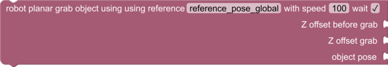
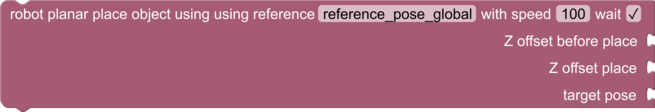

# Robotics Blocks and Sandbox Functions

"Robotics" section in the Blockly toolbox. Provides blocks and functions to query and command robots. These functions and blocks are provided by the `pyri-robotics` package.

## robot_movej

    robot_movej(joint_pos_degree, speed_perc, wait)

Move a robot in joint space with the specified speed percentage. A
trapezoidal trajectory will be used for the move. If wait is `True`,
the function will block until the robot has stopped. If it is
`False`, the function will return immediately. Use
`time_wait_for_completion()` or `time_wait_for_completion_all()`
to synchronize completion of the operation.

Parameters:

* joint_pos_degree (array): The desired joint position in degrees
* speed_perc (float): The move speed percentage, must be between 1 and 100
* wait (bool): True to block until completion, False to return immediately

## robot_movel

    robot_movel(target_pose, speed_perc, frame, wait)

Move a robot in a strait line in cartesian space with the specified 
speed percentage. A
trapezoidal trajectory will be used for the move. If wait is `True`,
the function will block until the robot has stopped. If it is
`False`, the function will return immediately. Use
`time_wait_for_completion()` or `time_wait_for_completion_all()`
to synchronize completion of the operation.

Parameters:

* target_pose (Pose): The desired robot flange pose in the specified frame
* speed_perc (float): The move speed percentage, must be between 1 and 100
* frame (str): The frame to use for `target_pose`. Must be `robot` or `world`.
* wait (bool): True to block until completion, False to return immediately

## robot_move_joint_trajectory

    robot_move_joint_trajectory(joint_trajectory, speed_perc, wait)

Execute a previously planned trajectory. This is typically returned
by a planner routine, or other advanced function.

Parameters:

* joint_pos_degree (array): The desired joint position in degrees
* speed_perc (float): The move speed percentage, must be between 1 and 100
* wait (bool): True to block until completion, False to return immediately

## robot_get_end_pose

    robot_get_end_pose(frame)

Returns the end pose of a robot. This end pose is reported by the
robot driver. It is typically defined as the flange of the robot,
but may be the tool if the driver is configured to report
the tool pose.

Parameters:

* frame (str): The frame to return the pose in. May be `robot` or `world`.

Return (Pose): The robot end pose in the requested frame

## robot_get_joint_position

    robot_get_joint_position()

Returns the joint position of the active robot, in degrees.

Return (array): The joint position in degrees

## robot_tool_gripper

    robot_tool_gripper(state)

Opens or closes the tool.

Parameters:

state (int): 1 to open, 0 to close

## robot_planar_grab

    robot_planar_grab(object_pose, grab_reference_pose, z_offset_before, z_offset_grab, speed_perc, wait)

Execute a planar grab operation. The planar grab operation is useful to grab an object
off a flat surface, such as a table. It is assumed that the world origin is configured
to be on the surface of the table, and that the XY plane is flat on the surface. A 
"reference pose" of joint angles is trained for the grab. This function will translate
the this reference pose to the specified X, Y, and Yaw position of the object as specified
in `object_pose` (all other components are ignored).

This function will move the tool above the object to `z_offset_before`, lower the tool
to `z_offset_grab`, close the tool, and raise the gripper to `z_offset_grab`. `z_offset_before`
and `z_offset_grab` are in meters, relative to the reference pose.

If wait is `True`,
the function will block until the robot has stopped. If it is
`False`, the function will return immediately. Use
`time_wait_for_completion()` or `time_wait_for_completion_all()`
to synchronize completion of the operation.

Parameters:

* object_pose (Pose): The pose of the object to grab. This pose must be flat on the table
* grab_reference_pose (array): A reference pose joint array, in degrees
* z_offset_before (float): Z offset before grab, in meters, relative to reference pose
* z_offset_grab (float): Z offset of grab, in meters, relative to reference pose
* speed_perc (float): The move speed percentage, must be between 1 and 100
* wait (bool): True to block until completion, False to return immediately

## robot_planar_place

    robot_planar_place(target_pose, place_reference_pose, z_offset_before, z_offset_place, speed_perc, wait)

Execute a planar place operation. The planar place operation is used to place an object
on a flat surface, such as a table. It is assumed that the world origin is configured
to be on the surface of the table, and that the XY plane is flat on the surface. A 
"place reference pose" of joint angles is trained for the place. This function will translate
the this reference pose to the specified X, Y, and Yaw position of the object as specified
in `target_pose` (all other components are ignored).

This function will move the tool above the target pose to `z_offset_before`, lower the tool
to `z_offset_place`, open the tool, and raise the gripper to `z_offset_place`. `z_offset_before`
and `z_offset_place` are in meters, relative to the reference pose.

If wait is `True`,
the function will block until the robot has stopped. If it is
`False`, the function will return immediately. Use
`time_wait_for_completion()` or `time_wait_for_completion_all()`
to synchronize completion of the operation.

This function is normally used to place on object grabbed using `robot_planar_grab()`.

Parameters:

* target_pose (Pose): The pose of the target object position. This pose must be flat on the table
* place_reference_pose (array): A reference pose joint array, in degrees
* z_offset_before (float): Z offset before place, in meters, relative to reference pose
* z_offset_place (float): Z offset of place, in meters, relative to reference pose
* speed_perc (float): The move speed percentage, must be between 1 and 100
* wait (bool): True to block until completion, False to return immediately

## robot_set_active_robot

    robot_set_active_robot(robot_name)

Set the active robot. All robot functions will act on this robot.
This has not effect on robots that are executing an asynchronous
operation. The default robot device name is `robot`.

Parameters:

* robot_name (str): The robot name

## robot_set_origin_calibration

    robot_set_origin_calibration(calibration_name)

Sets the active robot calibration. Robot calibration is normally a NamedPose or
NamedPoseWithCovariance variable saved in the global variable table. This calibration
can be created using the vision package calibration utilities, or by creating
a new NamedPose in the global variable table manually. The default
calibration name is `robot_origin_calibration`.

Parameters:

* calibration_name (str): The name of the global variable containing the calibration pose

## robot_set_active_tool

    robot_set_active_tool(tool_name)

Set the active tool. All tool related functions will act on this tool.
This has not effect on tools that are executing an asynchronous
operation. The default tool device name is `tool`.

Parameters:

* tool_name (str): The tool name
